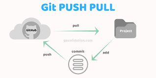

# Tech201-git-github
Tech201-git-github
## Git Push and Pull guide
### Testing
- Let's create our markdown file
- This line is added on localhost

### Step-by-step guide (Using Git Bash)

i) We created our repository Tech201-git-github on GitHub.

ii) We want to clone our repo from GitHub to localhost by copying the https link.

iii) Use `git clone _____` the blank space is where we put our repository link.

iv) We then create a new folder (directory) using `mkdir ___` giving our new directory a name and moving into the file using `cd`. 

v) We make sure everything is in place for us i.e. we ensure we are in the right folder using `pwd` before we look to make changes to our README file, which we can check is in our folder using `ls`.

vi) We then begin editing our README.md file by using `nano README.md` which will allow us to edit the file. Once we've made our changes on GitBash we use `ctrl x` to exit and then enter `y` when asked if we want to save and then we press `enter`. 

vii) We then use `git add .` to add all the changes we made in `nano` to our cloned repo.

viii) Then we use `git commit -m "message typically reminding us what change we are making"` to save our changes.

ix) Then we use `git push -u origin main` to push the changes to the main branch of our repository on GitHub so that they are now globally available.

